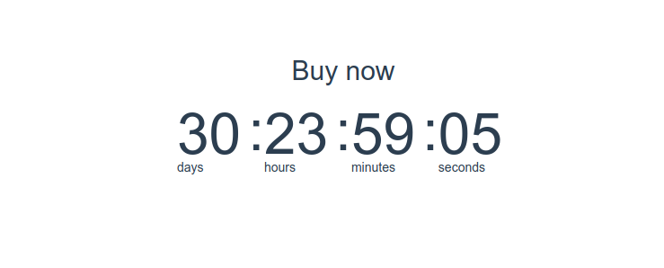

# Countdown Timer

## Desenvolvido com

* [Vue.js](https://vuejs.org/)
* [Tailwind CSS](https://tailwindcss.com/)

## Referência

* [Easiest Way To Create A Timer In JavaScript // Vue Countdown Timer in JavaScript Tutorial 2020 - Program With Erik](https://www.youtube.com/watch?v=Q_fLx2KcoYA)

## Screenshot

